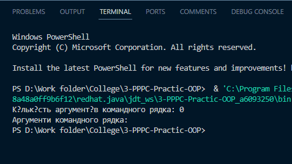
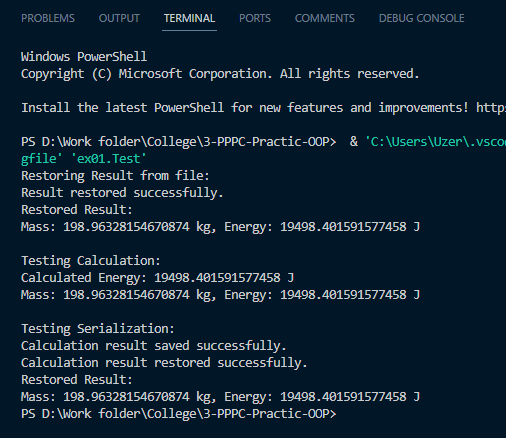
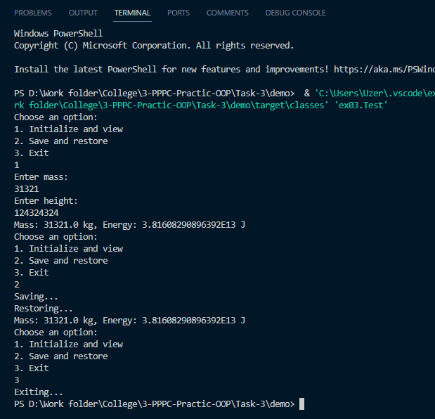
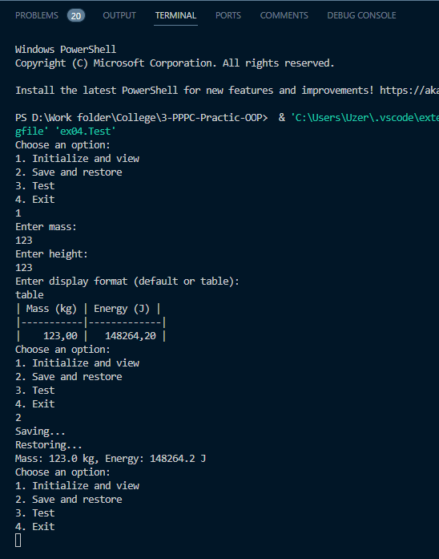
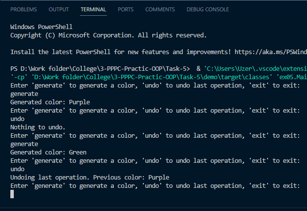
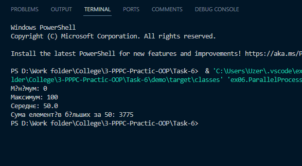

# Практика 

## Task 1

### Завдання

Написати просту консольну програму (наприклад вивід на екран аргументів командної строки).

### Робота програми

## Task 2

### Завдання

Розробити клас, що серіалізується, для зберігання параметрів і результатів обчислень. Використовуючи агрегування, розробити клас для знаходження рішення задачі. Розробити клас для демонстрації в діалоговому режимі збереження та відновлення стану об'єкта, використовуючи серіалізацію. Показати особливості використання transient полів. Розробити клас для тестування коректності результатів обчислень та серіалізації/десеріалізації.

### Робота програми

## Task 3

### Завдання

Як основа використовувати вихідний текст проекту попередньої лабораторної роботи. Забезпечити розміщення результатів обчислень уколекції з можливістю збереження/відновлення. Використовуючи шаблон проектування Factory Method (Virtual Constructor), розробити ієрархію, що передбачає розширення рахунок додавання нових відображуваних класів. Розширити ієрархію інтерфейсом "фабрикованих" об'єктів, що представляє набір методів для відображення результатів обчислень. Реалізувати ці методи виведення результатів у текстовому виде. Розробити тареалізувати інтерфейс для "фабрикуючого" методу.

### Робота програми

## Task 4

### Завдання

За основу використовувати вихідний текст проекту попередньої лабораторної роботи Використовуючи шаблон проектування Factory Method (Virtual Constructor), розширити ієрархію похідними класами, реалізують методи для подання результатів у вигляді текстової таблиці. Параметри відображення таблиці мають визначатися користувачем. Продемонструвати заміщення (перевизначення, overriding), поєднання (перевантаження, overloading), динамічне призначення методів (Пізнє зв'язування, поліморфізм, dynamic method dispatch). Забезпечити діалоговий інтерфейс із користувачем. Розробити клас для тестування основної функціональності.

### Робота програми

## Task 5

### Завдання

Реалізувати можливість скасування (undo) операцій (команд). Продемонструвати поняття "макрокоманда". При розробці програми використовувати шаблон Singletone. Забезпечити діалоговий інтерфейс із користувачем. Розробити клас для тестування функціональності програми.

### Робота програми

## Task 6

### Завдання

Продемонструвати можливість паралельної обробки елементів колекції (пошук мінімуму, максимуму, обчислення середнього значення, відбір за критерієм, статистична обробка тощо). Управління чергою завдань (команд) реалізувати за допомогою шаблону Worker Thread.

### Робота програми

